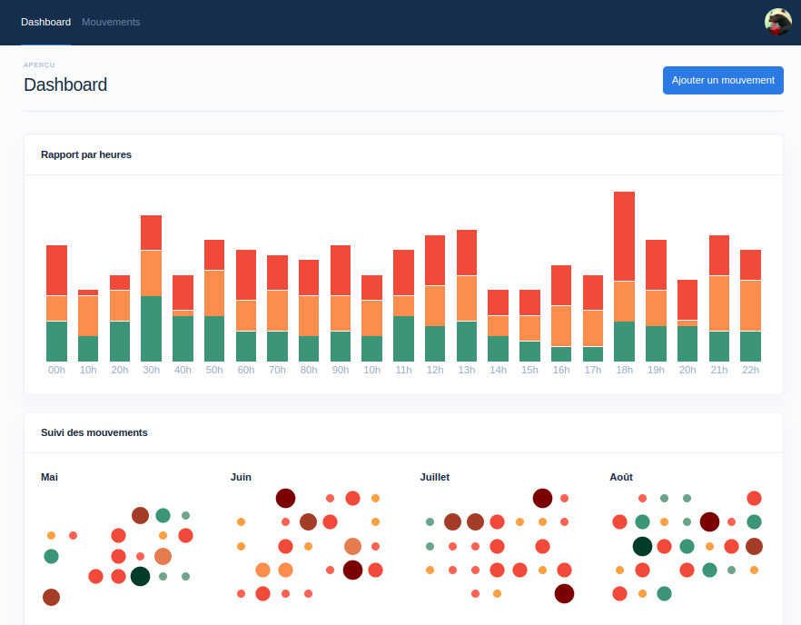

# Suivi du syndrome de Crohn

Petit projet pour suivre l'évolution des problèmes liés à la digestion et apprendre à mieux connaitre la maladie (Inspiré par ce [post reddit](https://www.reddit.com/r/dataisbeautiful/comments/107gn9x/oc_my_2022_poop_calendar_as_someone_with_ibd/)).

Le projet a été créé avec Laravel et SQLite pour permettre un hébergement facile sur n'importe quel hébergeur mutualisé.
